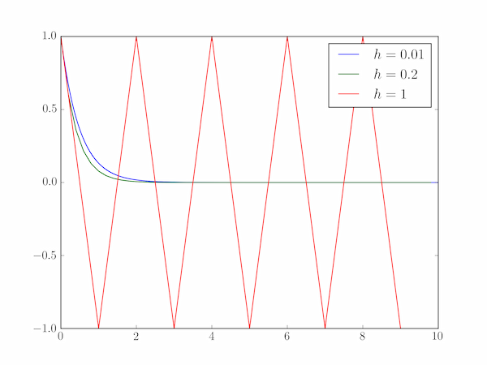

# Math 112C Spring 24 Notes, Part 1

## What is this class about? (Day 1)

- PDEs are used to build bridges, predict financial markets, describe the laws of physics, and the list goes on. 
- That presents an "applied" bias, but from a pure math perspective: they show up in geometry (Ricci flow), probability (random walks), and many other areas.
- MATH 112A and MATH 112B provide the **essential** foundation but there is a bit of a gap between this material and any applied problems.
- My goal of this class is to give you a "survey" of everything else out there. By no means exhaustive! But meant to excite you to the possibilities of why people like PDEs.
- (PDEs themselves are very interesting and mathematicians do study their behavior just for the sake of doing so. This leads to very intriguing and deep ideas. However, this will not be the emphasis of this course.)

###  Schematic of the Course

- **Weeks 1 through 3** Numerical methods for PDEs: 
  - Most PDEs are too complex to be solved (or even studied) using the ideas you learned in MATH 112AB. 
  - Instead, people (especially in engineering, sciences) construct approximate numerical solutions. This is a whole can of worms of theory & intrigue but also pitfalls & headaches.
  - MATH 107 (Numerical Solns to DEs) covers this for ODEs. Since this hasn't been offered in a few years, I will start with a very brief overview of these ideas. 
  - ~2 homework assignments (~2-3 problems each), coding in whatever language you want. 
- **Weeks 4 through 8** Applications of PDEs:
  - One interesting thing about PDEs (say compared to ODEs) is that there is no "one size fits all" theory. This incentivizes seeing many examples! 
  - The remainder of the class will be dedicated to exposure to PDEs in applications (mostly applied, but a few "pure"). 
  - We'll (1) give a self-contained derivation of the PDE, (2) do some basic theory or numerics for understanding it.
  - Topics planned include, with decreasing confidence we'll get to them:
    - waves and patterns in biology (Chris' bias)
    - random walks and probability
    - finance and Black-Scholes 
    - fluids, Navier-Stokes
    - inverse problems and medical imaging
    - electromagnetism, Maxwell's equations
  - If there is a topic (on or off) the list that you really care about and are excited to see: please tell Chris! 
  - ~ 1 homework each topic. 
- **Weeks 9-10** Project presentations:
  - The main "work" of the class is a final project. 
  - The idea is: you do some work outside of the class to "learn" a topic deeper, and then "teach" the class for a short presentation, and a write-up.
  - You can cover any topic so long as it's related to PDEs in some way.
  - There will be due dates throughout the quarter to make sure you are on-track.
  - Start thinking about this now! https://people.maths.ox.ac.uk/trefethen/pdectb.html an interesting place to start looking 
- Your grade will be: `20% participation  + 40% homework + 40% project`. 

### Day 1 classification reminder activity

To develop the right hammers, you must first identify the nails you are working with. 

Classify each of the equations as best you can. Discuss with a partner. Some descriptors that might be helpful include: 

- Is it an ODE or PDE? 
- What "order" is it? 1st order, 2nd order? 
- Is it linear? Non-linear? 
- Is it hyperbolic, parabolic, elliptic? 
- Does it have enough information to uniquely identify a solution? (e.g., are there enough boundary conditions?)
- Does this describe anything physically?

*(It is totally fine if you forget or have never heard of these !)*

1. $$ \frac{\partial y}{\partial t} + y^2 = e^{-t}, \quad y(0)=1.$$​
2. $$\partial_t u = \partial_{xx} u, \quad  u(-L,t)=0, \quad \partial_x u(L, t) =0.$$​
3. $$u_t - u_{xx} = ru(1-u), \quad u(x,0) = g(x), \quad x \in \mathbb{R}.$$​
4. $${\displaystyle {\frac {\partial }{\partial t}}(\rho \mathbf {u} )+\nabla \cdot \left(\rho \mathbf {u} \otimes \mathbf {u} +[p-\zeta (\nabla \cdot \mathbf {u} )]\mathbf {I} -\mu \left[\nabla \mathbf {u} +(\nabla \mathbf {u} )^{\mathrm {T} }-{\tfrac {2}{3}}(\nabla \cdot \mathbf {u} )\mathbf {I} \right]\right)=\rho \mathbf {g} .}$$​ 

---

## Part 1, Intro to Numerical Methods for ODEs & PDEs

- We will first start with the basics of numerically solving ODEs and use these techniques as "building blocks" for eventually solving PDEs. 

### Euler's method(s)

- Our model problem will be the "initial value problem" 

  $$ y'(t) = f(y,t), \quad y(0) = y_0.$$​

  We want $y(t)$ but it is too complicated to get analytically.

- (You might ask: Chris, why don't we consider higher order derivatives, like $y''$? Remember from MATH 3D that you can always "trade" derivatives for a larger but first-order system. So, we can imagine $y$ is a *vector* and all of these ideas still work for a huge array of problems.) 

- The idea: we want to solve from $t=0$ until some later $t=T$. We will "chop up" time $t_0=0, t_1= h, t_2 = t_1 + h = 2h$​ and so on.  $h$ is called the "step size" (we will think of this as fixed, but it need not be)

- Now we want to approximate our solution $y(t)$ at all of these times $y_1 \approx y(t_1)$ and so on. 

- How do we do this? One idea is **Taylor series**. Intuition: we know the answer at the previous time step $y(t_0)= y_0$ and we want to "extend" the function a little bit in a window around $t_0=0$, specifically to: $t = t_0+h = t_1$. 

- Taylor expanding $y(t)$ around $t_0$:

  $y(t) \approx y(t_0) + (t-t_0) y'(t_0) + \frac{1}{2}(t-t_0)^2 y''(t_0) + \cdots$​

  and plugging in $t = t_0+h = t_1$ gives us 

  $$ y(t_1) \approx y(t_0) + h f(y_0, t_0) + \frac{1}{2}h^2 y''(t_0) + \cdots$$

  Now here is a big observation! If $h$ is small, $h > h^2$ so the terms in this series continue to get smaller (and more negligible). So here is our first numerical scheme!

- **Forward Euler Step**: We now have our first numerical method. For the IVP $y' = f(y,t)$, we construct the approximate sequence $n=0, \ldots, N$:
  $$
  y_{n+1} = y_n + h f(y_n, t_n)
  $$

- Since we know the initial value $y_0$​, we can continually use this update rule in a "for loop".

  

- Just because we *can* do this, doesn't mean we *should*. That is, whenever you approximate something, you should always follow this with asking: *how good of an approximation is this?* 

- Answering these types of questions is a whole field of *numerical analysis* and we will give a taste of it here.

- For now, the "lesson" of this method is that if we have an equation with a derivative in it, we can "approximate" it straightforwardly $$ \frac{d y}{dt} \approx \frac{y_{n+1}-  y_n}{h}. $$​​

- Why? Although I did not derive it this way, note if we take $$ \frac{d y}{dt} \approx \frac{y_{n+1}-  y_n}{h} = f(y_n, t_n)$$ and rearrange, we get exactly the forward Euler. 

- Note this looks almost identical to the limit definition except that this is for a finite $h$, not $\lim_{h\to 0}$​. 

- If we think about deriving forward Euler this way: we use $y_n, t_n$ on the "right hand side" of the ODE. But why? What if we instead use $y_{n+1}$? $$ \frac{y_{n+1}-y_n}{h} =f(y_{n+1},t_{n+1})$$. 

- Rearranging this, we get $y_{n+1} = y_n + h f(y_{n+1},t_{n+1})$. We know all the $t_n$ so this is not a problem.. But now we do not have an explicit update rule for $y_{n+1}$. 

- **Forward** Euler (the first method) is sometimes called **explicit** Euler for this reason. This new method is known as **implicit Euler, or backward Euler**, since it "implicitly" defines the update rule. 

- Why forward/backward? In the first method, we use the "previous" value of $y_n$ to march forward in time. In this version, we need to find $y_{n+1}$ to effectively solve "backward" in time at each step.  

- A nice analogy is right-hand and left-hand Riemann sums you learned about in calculus.

- **Backward Euler method**: 
  $$
  y_{n+1} = y_n + h f(y_{n+1},t_{n+1}).
  $$
  How do we actually solve this? We need a method that can tackle this independently of how annoying $f$ is (possibly non-linear, so we don't just have $Ax=b$​). We have lots of options for solving non-linear systems. One (relatively easy) way is **Newton's Method**.

- Rearrange our equation into $$y_{n+1} - y_n - h f(y_{n+1},t_{n+1}) =0$$ and call this whole equation just $$G(y_{n+1})=0$$. So we want an algorithm for finding a root of $G(y)$. 

- **Newton's Method**: Given a starting guess $\tilde{y}_0$, we construct a **sequence** of $\tilde{y}_m$ values that approximate a root of $G(y)$ by 
  $$
  \tilde{y}_{m+1} = \tilde{y}_m + \frac{G(\tilde{y}_m)}{G'(\tilde{y}_m)}.
  $$

- A very confusing point is that this sequence is different than our ODE solution sequence!! These are just a "fake" sequence that get us closer and closer to solving $G(y) = 0$. In practice, how do we do this? We can take our initial guess as the previous value so $\tilde{y}_0 = y_n$ and run this update rule until our answer does not change much, so $|\tilde{y}_{m+1} - \tilde{y}_m| < \epsilon$ where we pre-specify our desired $\epsilon$. 

- So at this point, I have presented two different possible techniques for numerically solving the same ODE: forward and backward Euler. One of these was much more annoying than the other. 

- Why on Earth would anyone do the a complicated numerical? Is there any way in which it is "better"? This leads to the notion of - how do we quantify the performance of a numerical method? 

- Really there are two facets: "performance" - how "well" does it behave or approximate? And "cost" - usually in terms of computing power, but we can also factor in "human cost", like is this very annoying to program? 

### Error and Stability for Euler Methods

- It is not so easy to come up with a single metric of success for a numerical method for DEs. In fact, we will see there are many options and they capture different ideas.

- Some errors are called “roundoff” or “floating point” - these have to do with how computers store and represent numbers (how does a computer represent $1/3$ with bits $0,1$? ) but we will ignore these

- Instead we want to focus on the error in approximating solutions to DEs

- **Local error** is the error introduced at each step, **global error** is the total accumulated error between the true and approximate solution. A bit esoteric but easier to see concretely in example

- Call $y(t_n)$ the true solution and $y_n$ our approximation, so $y_n \approx y(t_n)$.

- We want to know $E = y(t_n)  - y_n$, or how far off the true solution is from the approximate. This seems hopeless. How do we compute this without knowing the true solution? This is the beauty of numerical analysis.

- Plug in $y(t_n)$ to our update rule supposing we *did* know it, so $$ y_{n+1} = y(t_n) + h f(y(t_n),t_n)$$ note the very important notation! We are not using $y_n$ on the right side, but $y(t_n)$. 

- We also know $f = y’$ so this is $$y_{n+1} = y(t_n)+ h y’(t_n)$$. 

- Next, we can Taylor Series $$ y(t_{n+1}) = y(t_n +h) = y(t_n) + h y’(t_n) + (h^2/2)y''(t_n) + \cdots$$

- How do we put this all together? Back to the error. $E = y(t_{n+1})-y_{n+1}$. This gives us 
  $$
  E = y(t_{n+1}) - y_{n+1} \\
  \approx [y(t_n) + h y'(t_n) + (h^2/2)y''(t_n) + \cdots] - [y(t_n)+hy'(t_n)]\\
  = (h^2/2)y'' + \cdots
  $$

- The cancelation is the key step! This says that if we *knew* our true value exactly, the error introduced at each step (local error) scales with $h^2$. Note the $\cdots$ terms are even smaller because we assume $h$ is small. Therefore, we will say the local error of forward Euler is “order” $h^2$ or $\mathcal{O}(h^2)$ where $\mathcal{O}$ has a precise meaning we won’t get into.

- Why is this useful info? It tells us how the error behaves! If we make $h$ 10x smaller, the error gets approximately 100x smaller. 

- Why not always make a small $h$? If we want to solve $t=[0,T]$ then the number of steps is $N=T/h$, so smaller $h$ means more steps.

- Roughly, if we say local error $\approx kh^2$ and $N \approx T/h$, then a crude calculation argues that **global error** $\approx$ # of steps x error at each step, $= (T/h)(kh^2) \approx \mathcal{O}(h)$.

- That is, the *global* error of forward Euler scales with $h$ or “first order”. Intuitively, the global error should be worse than local error.

- As you might guess, this is pretty much the worst performance we could hope for. To make the error 100x smaller, we need to make $h$ 100x smaller. Ideally we want *higher order* methods, where decreasing $h$ helps us more and more.

- Is this the end of the story? No. 

- Consider the “test problem” $y’ = -3y$ or really any $y’=\lambda y$ with $\lambda <0$​.What should solutions do? Decay!

- **In-class exercise**: Take that ODE with $h=1$ or $h=2$ and try a few forward Euler steps. What happens? 

- If we choose $h$ too large, not only is the approximation “bad”, we don’t even get qualitative agreement.

  

- This suggests we need another idea. This is the notion of **numerical stability**. 
- Let’s go back to our test problem $y’ = \lambda y$ with $\lambda <0$. We know the solution is $y = ce^{\lambda t}$ so solutions should decay. We want our numerical scheme to mimic this.
- What does forward Euler do to our test problem? $y_{n+1} = y_n + h f(y_n, t_n) = y_n + h \lambda y_n = (1+h\lambda) y_n$.
- So $y_0 =  y_0$, $y_1 = (1+\lambda h) y_0$ $y_2 = (1+\lambda h) y_1 = (1+\lambda h)^2 y_0$. Following this pattern $y_n = (1+\lambda h)^n y_0$. 
- Easy to plug in to see weird or nice behavior. $\lambda=-3, h=1$ or $h=1/100$. How to generalize?
-  Geometric series. Convergent if $|1+\lambda h| <1$. 
- For real $\lambda$: $-1 < 1 + \lambda h < 1$, so  $-2 < \lambda h < 0$  and since $\lambda <0$ the right condition doesn’t matter, just $h < -2/\lambda$. This is our stability condition! Forward Euler is *conditionally stable*!
- But $|1+\lambda h|<1$ makes sense even for complex $\lambda$. For instance, $\lambda = - 1 + 3i$ has solutions $y = e^{-t}(\cos 3t + \sin 3t)$ so it should still decay. 
- If we call $z=\lambda h$. What does $|1+z| < 1$ look like in the complex plane? $z= x + iy$. $|z|<1$ is a circle, $|1+z|<1$ is a shifted circle. 
- What about backward Euler? 
- $y_{n+1} = y_n + h f(y_{n+1}, t_{n+1})$ with $y’ = \lambda y$ gives us $y_{n+1} = y_n + h\lambda y_{n+1}$. Rearranging, we’ve got $(1-\lambda h)y_{n+1} = y_n$ so $y_{n+1} = y_n/(1-\lambda h)$. 
- Following the same pattern, $y_n = (1/(1-\lambda h))^n y_0$. So $|1/(1-\lambda h)| < 1$. When does this hold for $\lambda$ real, complex? 
- For real $\lambda$: $1 < |1-\lambda h|$  so $1-\lambda h > 1$ or $1-\lambda h < -1$. Following the first one gives us $- \lambda h > 0$, always true so the second is irrelevant. Therefore, this is always true. **Backward Euler is unconditionally stable**.
- In practice? This means we can be very greedy with big step sizes $h$. 
- For complex $\lambda$: don’t worry about this unless you’re a complex analysis aficionado, but $1<|z|$ is the exterior of a circle, so $1 < |1+z|$ is shifted to the right. But we typically only care about $\Re z <0$ which is completely covered, so we have unconditional stability. 
- What do I want you to take from this? 
- **The fundamental theorem**: consistency + stability <-> convergence
- **consistency** means: local error $\to 0$  as $h \to 0$. roughly, we can make errors as small as you want
- **stability** informally means: your approximate solution does not accumulate errors.
- Roughly: for our numerical method to be “good” - we need small errors AND for these errors to not accumulate and grow out of control.
- Or put another way: consistency says we are well-approximating SOMETHING, and stability says we are approximating the RIGHT thing. Together, we have a GOOD approximation of the RIGHT thing.
- Next, onto PDES!

### Finite differences for the heat equation

