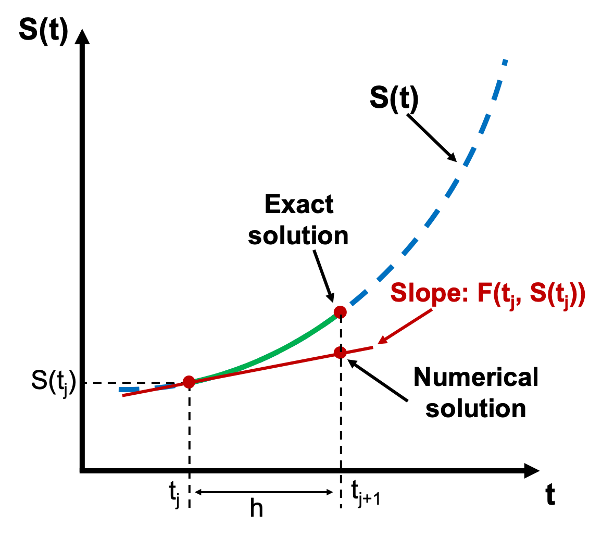
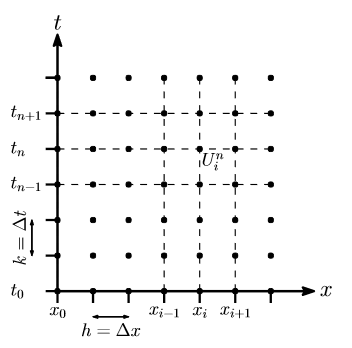
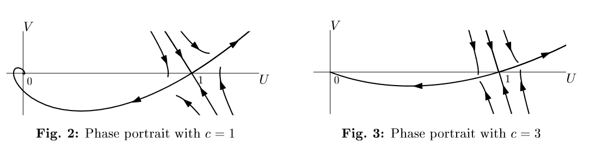

# Math 112C Spring 24 Notes, Part 1

## What is this class about? (Day 1)

- PDEs are used to build bridges, predict financial markets, describe the laws of physics, and the list goes on. 
- That presents an "applied" bias, but from a pure math perspective: they show up in geometry (Ricci flow), probability (random walks), and many other areas.
- MATH 112A and MATH 112B provide the **essential** foundation but there is a bit of a gap between this material and any applied problems.
- My goal of this class is to give you a "survey" of everything else out there. By no means exhaustive! But meant to excite you to the possibilities of why people like PDEs.
- (PDEs themselves are very interesting and mathematicians do study their behavior just for the sake of doing so. This leads to very intriguing and deep ideas. However, this will not be the emphasis of this course.)

###  Schematic of the Course

- **Weeks 1 through 3** Numerical methods for PDEs: 
  - Most PDEs are too complex to be solved (or even studied) using the ideas you learned in MATH 112AB. 
  - Instead, people (especially in engineering, sciences) construct approximate numerical solutions. This is a whole can of worms of theory & intrigue but also pitfalls & headaches.
  - MATH 107 (Numerical Solns to DEs) covers this for ODEs. Since this hasn't been offered in a few years, I will start with a very brief overview of these ideas. 
  - ~2 homework assignments (~2-3 problems each), coding in whatever language you want. 
- **Weeks 4 through 8** Applications of PDEs:
  - One interesting thing about PDEs (say compared to ODEs) is that there is no "one size fits all" theory. This incentivizes seeing many examples! 
  - The remainder of the class will be dedicated to exposure to PDEs in applications (mostly applied, but a few "pure"). 
  - We'll (1) give a self-contained derivation of the PDE, (2) do some basic theory or numerics for understanding it.
  - Topics planned include, with decreasing confidence we'll get to them:
    - waves and patterns in biology (Chris' bias)
    - random walks and probability
    - finance and Black-Scholes 
    - fluids, Navier-Stokes
    - inverse problems and medical imaging
    - electromagnetism, Maxwell's equations
  - If there is a topic (on or off) the list that you really care about and are excited to see: please tell Chris! 
  - ~ 1 homework each topic. 
- **Weeks 9-10** Project presentations:
  - The main "work" of the class is a final project. 
  - The idea is: you do some work outside of the class to "learn" a topic deeper, and then "teach" the class for a short presentation, and a write-up.
  - You can cover any topic so long as it's related to PDEs in some way.
  - There will be due dates throughout the quarter to make sure you are on-track.
  - Start thinking about this now! https://people.maths.ox.ac.uk/trefethen/pdectb.html an interesting place to start looking 
- Your grade will be: `20% participation  + 40% homework + 40% project`. 

### Day 1 classification reminder activity

To develop the right hammers, you must first identify the nails you are working with. 

Classify each of the equations as best you can. Discuss with a partner. Some descriptors that might be helpful include: 

- Is it an ODE or PDE? 
- What "order" is it? 1st order, 2nd order? 
- Is it linear? Non-linear? 
- Is it hyperbolic, parabolic, elliptic? 
- Does it have enough information to uniquely identify a solution? (e.g., are there enough boundary conditions?)
- Does this describe anything physically?

*(It is totally fine if you forget or have never heard of these !)*

1. $$ \frac{\partial y}{\partial t} + y^2 = e^{-t}, \quad y(0)=1.$$​
2. $$\partial_t u = \partial_{xx} u, \quad  u(-L,t)=0, \quad \partial_x u(L, t) =0.$$​
3. $$u_t - u_{xx} = ru(1-u), \quad u(x,0) = g(x), \quad x \in \mathbb{R}.$$​
4. $${\displaystyle {\frac {\partial }{\partial t}}(\rho \mathbf {u} )+\nabla \cdot \left(\rho \mathbf {u} \otimes \mathbf {u} +[p-\zeta (\nabla \cdot \mathbf {u} )]\mathbf {I} -\mu \left[\nabla \mathbf {u} +(\nabla \mathbf {u} )^{\mathrm {T} }-{\tfrac {2}{3}}(\nabla \cdot \mathbf {u} )\mathbf {I} \right]\right)=\rho \mathbf {g} .}$$​ 

## Part 1, Intro to Numerical Methods for ODEs & PDEs

- We will first start with the basics of numerically solving ODEs and use these techniques as "building blocks" for eventually solving PDEs. 

### Euler's method(s)

- Our model problem will be the "initial value problem" 

  $$ y'(t) = f(y,t), \quad y(0) = y_0.$$​

  We want $y(t)$ but it is too complicated to get analytically.

- (You might ask: Chris, why don't we consider higher order derivatives, like $y''$? Remember from MATH 3D that you can always "trade" derivatives for a larger but first-order system. So, we can imagine $y$ is a *vector* and all of these ideas still work for a huge array of problems.) 

- The idea: we want to solve from $t=0$ until some later $t=T$. We will "chop up" time $t_0=0, t_1= h, t_2 = t_1 + h = 2h$​ and so on.  $h$ is called the "step size" (we will think of this as fixed, but it need not be)

- Now we want to approximate our solution $y(t)$ at all of these times $y_1 \approx y(t_1)$ and so on. 

- How do we do this? One idea is **Taylor series**. Intuition: we know the answer at the previous time step $y(t_0)= y_0$ and we want to "extend" the function a little bit in a window around $t_0=0$, specifically to: $t = t_0+h = t_1$. 

- Taylor expanding $y(t)$ around $t_0$:

  $y(t) \approx y(t_0) + (t-t_0) y'(t_0) + \frac{1}{2}(t-t_0)^2 y''(t_0) + \cdots$​

  and plugging in $t = t_0+h = t_1$ gives us 

  $$ y(t_1) \approx y(t_0) + h f(y_0, t_0) + \frac{1}{2}h^2 y''(t_0) + \cdots$$

  Now here is a big observation! If $h$ is small, $h > h^2$ so the terms in this series continue to get smaller (and more negligible). So here is our first numerical scheme!

- **Forward Euler Step**: We now have our first numerical method. For the IVP $y' = f(y,t)$, we construct the approximate sequence $n=0, \ldots, N$:
  $$
  y_{n+1} = y_n + h f(y_n, t_n)
  $$

- Since we know the initial value $y_0$​, we can continually use this update rule in a "for loop".

  

- Just because we *can* do this, doesn't mean we *should*. That is, whenever you approximate something, you should always follow this with asking: *how good of an approximation is this?* 

- Answering these types of questions is a whole field of *numerical analysis* and we will give a taste of it here.

- For now, the "lesson" of this method is that if we have an equation with a derivative in it, we can "approximate" it straightforwardly $$ \frac{d y}{dt} \approx \frac{y_{n+1}-  y_n}{h}. $$​​

- Why? Although I did not derive it this way, note if we take $$ \frac{d y}{dt} \approx \frac{y_{n+1}-  y_n}{h} = f(y_n, t_n)$$ and rearrange, we get exactly the forward Euler. 

- Note this looks almost identical to the limit definition except that this is for a finite $h$, not $\lim_{h\to 0}$​. 

- If we think about deriving forward Euler this way: we use $y_n, t_n$ on the "right hand side" of the ODE. But why? What if we instead use $y_{n+1}$? $$ \frac{y_{n+1}-y_n}{h} =f(y_{n+1},t_{n+1})$$. 

- Rearranging this, we get $y_{n+1} = y_n + h f(y_{n+1},t_{n+1})$. We know all the $t_n$ so this is not a problem.. But now we do not have an explicit update rule for $y_{n+1}$. 

- **Forward** Euler (the first method) is sometimes called **explicit** Euler for this reason. This new method is known as **implicit Euler, or backward Euler**, since it "implicitly" defines the update rule. 

- Why forward/backward? In the first method, we use the "previous" value of $y_n$ to march forward in time. In this version, we need to find $y_{n+1}$ to effectively solve "backward" in time at each step.  

- A nice analogy is right-hand and left-hand Riemann sums you learned about in calculus.

- **Backward Euler method**: 
  $$
  y_{n+1} = y_n + h f(y_{n+1},t_{n+1}).
  $$
  How do we actually solve this? We need a method that can tackle this independently of how annoying $f$ is (possibly non-linear, so we don't just have $Ax=b$​). We have lots of options for solving non-linear systems. One (relatively easy) way is **Newton's Method**.

- Rearrange our equation into $$y_{n+1} - y_n - h f(y_{n+1},t_{n+1}) =0$$ and call this whole equation just $$G(y_{n+1})=0$$. So we want an algorithm for finding a root of $G(y)$. 

- **Newton's Method**: Given a starting guess $\tilde{y}_0$, we construct a **sequence** of $\tilde{y}_m$ values that approximate a root of $G(y)$ by 
  $$
  \tilde{y}_{m+1} = \tilde{y}_m + \frac{G(\tilde{y}_m)}{G'(\tilde{y}_m)}.
  $$

- A very confusing point is that this sequence is different than our ODE solution sequence!! These are just a "fake" sequence that get us closer and closer to solving $G(y) = 0$. In practice, how do we do this? We can take our initial guess as the previous value so $\tilde{y}_0 = y_n$ and run this update rule until our answer does not change much, so $|\tilde{y}_{m+1} - \tilde{y}_m| < \epsilon$ where we pre-specify our desired $\epsilon$. 

- So at this point, I have presented two different possible techniques for numerically solving the same ODE: forward and backward Euler. One of these was much more annoying than the other. 

- Why on Earth would anyone do the a complicated numerical? Is there any way in which it is "better"? This leads to the notion of - how do we quantify the performance of a numerical method? 

- Really there are two facets: "performance" - how "well" does it behave or approximate? And "cost" - usually in terms of computing power, but we can also factor in "human cost", like is this very annoying to program? 

### Error and Stability for Euler Methods

- It is not so easy to come up with a single metric of success for a numerical method for DEs. In fact, we will see there are many options and they capture different ideas.

- Some errors are called “roundoff” or “floating point” - these have to do with how computers store and represent numbers (how does a computer represent $1/3$ with bits $0,1$? ) but we will ignore these

- Instead we want to focus on the error in approximating solutions to DEs

- **Local error** is the error introduced at each step, **global error** is the total accumulated error between the true and approximate solution. A bit esoteric but easier to see concretely in example

- Call $y(t_n)$ the true solution and $y_n$ our approximation, so $y_n \approx y(t_n)$.

- We want to know $E = y(t_n)  - y_n$, or how far off the true solution is from the approximate. This seems hopeless. How do we compute this without knowing the true solution? This is the beauty of numerical analysis.

- Plug in $y(t_n)$ to our update rule supposing we *did* know it, so $$ y_{n+1} = y(t_n) + h f(y(t_n),t_n)$$ note the very important notation! We are not using $y_n$ on the right side, but $y(t_n)$. 

- We also know $f = y’$ so this is $$y_{n+1} = y(t_n)+ h y’(t_n)$$. 

- Next, we can Taylor Series $$ y(t_{n+1}) = y(t_n +h) = y(t_n) + h y’(t_n) + (h^2/2)y''(t_n) + \cdots$$

- How do we put this all together? Back to the error. $E = y(t_{n+1})-y_{n+1}$. This gives us 
  $$
  E = y(t_{n+1}) - y_{n+1} \\
  \approx [y(t_n) + h y'(t_n) + (h^2/2)y''(t_n) + \cdots] - [y(t_n)+hy'(t_n)]\\
  = (h^2/2)y'' + \cdots
  $$

- The cancelation is the key step! This says that if we *knew* our true value exactly, the error introduced at each step (local error) scales with $h^2$. Note the $\cdots$ terms are even smaller because we assume $h$ is small. Therefore, we will say the local error of forward Euler is “order” $h^2$ or $\mathcal{O}(h^2)$ where $\mathcal{O}$ has a precise meaning we won’t get into.

- Why is this useful info? It tells us how the error behaves! If we make $h$ 10x smaller, the error gets approximately 100x smaller. 

- Why not always make a small $h$? If we want to solve $t=[0,T]$ then the number of steps is $N=T/h$, so smaller $h$ means more steps.

- Roughly, if we say local error $\approx kh^2$ and $N \approx T/h$, then a crude calculation argues that **global error** $\approx$ # of steps x error at each step, $= (T/h)(kh^2) \approx \mathcal{O}(h)$.

- That is, the *global* error of forward Euler scales with $h$ or “first order”. Intuitively, the global error should be worse than local error.

- As you might guess, this is pretty much the worst performance we could hope for. To make the error 100x smaller, we need to make $h$ 100x smaller. Ideally we want *higher order* methods, where decreasing $h$ helps us more and more.

- Is this the end of the story? No. 

- Consider the “test problem” $y’ = -3y$ or really any $y’=\lambda y$ with $\lambda <0$​.What should solutions do? Decay!

- **In-class exercise**: Take that ODE with $h=1$ or $h=2$ and try a few forward Euler steps. What happens? 

- If we choose $h$ too large, not only is the approximation “bad”, we don’t even get qualitative agreement.

  


- This suggests we need another idea. This is the notion of **numerical stability**. 
- Let’s go back to our test problem $y’ = \lambda y$ with $\lambda <0$. We know the solution is $y = ce^{\lambda t}$ so solutions should decay. We want our numerical scheme to mimic this.
- What does forward Euler do to our test problem? $y_{n+1} = y_n + h f(y_n, t_n) = y_n + h \lambda y_n = (1+h\lambda) y_n$.
- So $y_0 =  y_0$, $y_1 = (1+\lambda h) y_0$ $y_2 = (1+\lambda h) y_1 = (1+\lambda h)^2 y_0$. Following this pattern $y_n = (1+\lambda h)^n y_0$. 
- Easy to plug in to see weird or nice behavior. $\lambda=-3, h=1$ or $h=1/100$. How to generalize?
-  Geometric series. Convergent if $|1+\lambda h| <1$. 
- For real $\lambda$: $-1 < 1 + \lambda h < 1$, so  $-2 < \lambda h < 0$  and since $\lambda <0$ the right condition doesn’t matter, just $h < -2/\lambda$. This is our stability condition! Forward Euler is *conditionally stable*!
- But $|1+\lambda h|<1$ makes sense even for complex $\lambda$. For instance, $\lambda = - 1 + 3i$ has solutions $y = e^{-t}(\cos 3t + \sin 3t)$ so it should still decay. 
- If we call $z=\lambda h$. What does $|1+z| < 1$ look like in the complex plane? $z= x + iy$. $|z|<1$ is a circle, $|1+z|<1$ is a shifted circle. 
- What about backward Euler? 
- $y_{n+1} = y_n + h f(y_{n+1}, t_{n+1})$ with $y’ = \lambda y$ gives us $y_{n+1} = y_n + h\lambda y_{n+1}$. Rearranging, we’ve got $(1-\lambda h)y_{n+1} = y_n$ so $y_{n+1} = y_n/(1-\lambda h)$. 
- Following the same pattern, $y_n = (1/(1-\lambda h))^n y_0$. So $|1/(1-\lambda h)| < 1$. When does this hold for $\lambda$ real, complex? 
- For real $\lambda$: $1 < |1-\lambda h|$  so $1-\lambda h > 1$ or $1-\lambda h < -1$. Following the first one gives us $- \lambda h > 0$, always true so the second is irrelevant. Therefore, this is always true. **Backward Euler is unconditionally stable**.
- In practice? This means we can be very greedy with big step sizes $h$. 
- For complex $\lambda$: don’t worry about this unless you’re a complex analysis aficionado, but $1<|z|$ is the exterior of a circle, so $1 < |1+z|$ is shifted to the right. But we typically only care about $\Re z <0$ which is completely covered, so we have unconditional stability. 
- What do I want you to take from this? 
- **The fundamental theorem**: consistency + stability <-> convergence
- **consistency** means: local error $\to 0$  as $h \to 0$. roughly, we can make errors as small as you want
- **stability** informally means: your approximate solution does not accumulate errors.
- Roughly: for our numerical method to be “good” - we need small errors AND for these errors to not accumulate and grow out of control.
- Or put another way: consistency says we are well-approximating SOMETHING, and stability says we are approximating the RIGHT thing. Together, we have a GOOD approximation of the RIGHT thing.
- Lots of other numerical approaches for ODEs but for now this will do.
- Both these broad ideas and details of the approaches are helpful for PDEs. 

### Finite differences & PDEs

- There are a few “families” of approaches. 
- We will focus on **finite difference** approaches that basically follow the same “flavor” as the ODE methods we just discussed. These are the easiest to understand and implement, but are challenging on complex geometries.
- Other approaches include **finite elements** – widely used in engineering. Better at strange geometries but mathematically a bit tricky, so we won’t touch. But there are good softwares (COMSOL) that implement these for engineers.
- Finite differences uses a grid. It could be uniform (rectangular), non-uniform, or even some other “mesh”, but uniform rectangular is easiest so we’ll start there.
- **Key idea** replace derivatives by finite $h$ versions, derived by truncating Taylor series.
- We already know a few!
- $\partial_t u \to [u(x,t+k)-u(x,t)]/k$ but this doesn’t need to be only in time, we could also do
- $\partial_x u \to [u(x+h,t)-u(x,t)]/h$. Note that we need to use different symbols for our grid spacing $\Delta x = k$ and $\Delta t =h$. This is pretty common notation.
- These were “forward” differences (because we evaluate at values forward of current $(x,t)$ but we could also do backward $\partial_t u \to [u(x,t)-u(x,t-k)]/k$ 
- Or even centered $\partial_t u \to [u(x, t+k/2) - u(x,t-k/2)]/k$ and this is also reasonable!
- Notation: $\delta_h^f[u]$ is the forward difference with size $h$. We can also call $\delta_h^b[u]$ backward and $\delta_h^c[u]$ centered. 
- How do we derive new finite difference schemes? By combining old!
- **In class activity**: split into 3 groups, each group does one:
  1. $\delta_{h/2}^c[\delta_{h/2}^c[u]]$​​ 
  2. $\delta_{f}^c[\delta_{b}^c[u]]$
  3.  $\delta_{b}^c[\delta_{f}^c[u]]$

- Would we get the same as $\delta_{f}^c[\delta_{f}^c[u]]$? Probably not. This ONLY looks forward. But still a valid approximation!

- All of the 3 I listed give us the same answer, a fundamental approximation called the “center difference scheme for $\partial_{xx}$:
  $$
  \partial_{xx} u \to \frac{u(x+h, t)-2u(x,t)+u(x+h,t)}{h^2}
  $$
  
- So we have stumbled into lots of options for taking derivatives. How do we make sense of these? Typically people describe a finite difference approximation by two quantities:

- **Direction** (forward, back, central) and **order** (local truncation error scales $h^p$ for order $p$​)

- How do we compute order? The recipe is always take $\text{true} - \text{approx}$ and Taylor expand. Leading order is the order.

- For instance, $E = [u(x+h)-u(x)]/h - u’(x)$ Taylor expand, we get $h^{-1}[u + h u’ + (h^2/2)u'' + \cdots - u]   -u’$

- And of course  this leaves us with $hu'' + \cdots$ so this is a **first order method**. Specifically, we would say “first order forward approximation”

- What about $[u(x+h)-u(x-h)]/[2h] - u’$ ? Expand… and you’ll get $h^2$. This is a “second order central” approximation! 

- Higher order is obviously better. note that if we are moving forward in time $x \to t$ then the central scheme requires us to “look into the future” and probably makes our method implicit. We’ll see more of these tradeoffs.

### Finite difference solution to the heat equation

- Let’s solve our first PDE. We now have finite difference approximations as building blocks and we can put them together. 

- Take $\partial_t u =  D\partial_{xx} u$ with $u(x,0)=g(x)$ and $u(0,t)=A$ and $u(L, t)=B$. 

- Most “standard”scheme is **forward in time, centered in space** (FTCS).

- Call $U_i^n$ our grid point so that $U_i^n \approx u(x_i, t_n) = u(nh, tk)$.  

  

  

- Now based on the name (FTCS) we can guess the finite difference approximations. 

- $\partial_t u \to [U^{n+1}_j - U^{n}_j] /k$​ 

- $\partial_{xx} \to [U^{n}_{j+1}-2U_j^n+U_{j-1}^n]/(h^2)$

- Putting this together, we have our first numerical scheme for the heat equation:
  $$
  \frac{U_j^{n+1}-U_j}{k} = D \frac{U_{j+1}^n-2U_j^n+U_{j-1}}{h^2}
  $$

- Now there are many questions we could ask.

  - How do we actually solve this (or program it into a computer)?
  - Did we forget to incorporate any info about our problem in this scheme? (hint, what else do we know?)
  - What is the error of this scheme? (is it consistent?)
  - Is this a stable scheme? (in the ODE sense – if we expect solutions to decay, they actually do)

- Let’s start with the first point. Note we can rearrange this to be
  $$
  U_{j}^{n+1} = U_j^n + \frac{Dk}{h^2}[U_{j+1}^n + U_{j-1}^n-2U_j^n]
  $$

- Now we can march forward in time $n=0, n=1, \ldots$. 

- But what do we start with? Now we need our boundary/initial conditions!

- $u(x,0) = g(x)$ Discretize this so that $g(x_i) = g_i$ and we can take $U_j^n = g_j$. 

- We haven’t touched boundary conditions quite yet… But we will later.

- Next, what about accuracy? Same idea as ODEs. Local truncation error is true - exact and then we Taylor expand. Or a shortcut!
- Just look at numerical scheme. $S(x,t) = \frac{u(x,t+k)-u(x,t)}{k} - \frac{D}{h^2}[u(x+h,t)-2u(x,t)+u(x-h,t)]$​. If our method was exact, $S$​ should be zero. But it’s not, so anything left over is error. 
- Taylor expand, and use PDE, and you’re left with $S(x,t) \sim \alpha k^1 + \beta h^2$ so this method is $\mathcal{O}(k+h^2)$ or “first order in time, second order in space”.
- Stability is much harder. I will do a sketch for intuition here and homework will be doing the “proper” way.
- Roughly our method looks like $\text{new} = (1-(2Dk)/h^2) \text{old}$ or at least that’s roughly how much each $U_i^n$​ gets updated. 
- So $|1 - (2Dk)/h^2|<1$ and rearrange, we get $Dk/h^2<1$​. This is the right intuition. 
- **Smaller $h$ requires smaller $k$**. As in, they are linked now! You can’t just take very large $k$ without sacrificing a spatial penalty for stability. 
- Or put another way, if you want high spatial accuracy, you also have to take small temporal steps. Surprising!

#### Practical aspects of finite differences (on the heat equation)

```matlab
% heat eqn with a for loop
clear all; close all;
% --- Assign physical and mesh parameters
nt=500; nx=20;
D = 0.1; L = 1; tmax = 2; % Diffusion coefficient, domain length and max time
dx = L/(nx-1); dt = tmax/(nt-1);
r = D*dt/dx^2; r2 = 1 - 2*r;
A=0; B=0;
% --- Assign IC and BC. u is initialized to a vector that includes BC
x = linspace(0,L,nx)'; u = sin(pi*x/L);
u(1)=A; u(end)=B;
figure;
% --- Loop over time steps
for k=2:nt
    uold = u; % prepare for next step
    for i=2:nx-1
        u(i) = r*uold(i-1) + r2*uold(i) + r*uold(i+1);
    end
    if mod(k,10) == 0 % plot every 10 frames
        hold on;
        plot(x,u);
        drawnow;
    end
end
```

- Back to solving… On the homework, we have “periodic” boundary conditions, which means that $u(-1,t)=u(1,t)$​. This is like solving the heat equation on a ring.

- In class, we discussed the “easiest” case of Dirichlet boundaries $u(-1,t)=A$ because we can just set $U_0^n=A$ and no need to ever solve for it. 

- I won’t tell you how to implement periodic, but let’s look at another boundary condition. What if we had something like $\partial_x u (0,t)=A$?  This is a little tough because we don’t know what $U_0^n$ is any more. 

- Finite difference! $\frac{U_1^n-U_0^n}{h} = A$, so this says that $U_0^n=hA - U_1^n$. We can just use this as the update rule for $U_0$ rather than the “PDE” update rule from FTCS. 

- For the homework, periodic boundary conditions work a little different… You still want to use the PDE update rule, but for, say, updating $U_0^n$, what is $U_{-1}^n$​?  

- Back to actually programming this. I give some MATLAB code above. But I would say this is a “crude” implementation. In practice, people do not use a “for” loop often to loop over points. Instead, we want to exploit the linearity of this approach to write this as a matrix/vector operation.

- First, note that we can write our PDE update rule in terms of $\lambda$ as $\lambda = Dk/h^2$ and then
  $$
  U_{j}^{n+1} = \lambda U_{j+1}^n + (1-2\lambda) U_{j}^n + U_{j-1}^n
  $$

- Now if we think of each $U^n = [U_j^n] = [U_1^n,U_2^n,\ldots,U_M^n]$, a vector, we can write this as a matrix operation
  $$
  U^{n+1} = \begin{bmatrix}1-2\lambda&\lambda&0&\ldots &0\\\lambda&1-2\lambda&\lambda&\ddots &\vdots \\0&\ddots &\ddots &\ddots &0\\\vdots &&\lambda&1-2\lambda&\lambda\\0&\ldots &0&\lambda&1-2\lambda \end{bmatrix} \begin{bmatrix}U_1^n\\ U_2^n \\  \vdots \\  U_{M-1}^n\end{bmatrix}
  $$

- This is great news! Neglecting boundary conditions, this says we can update all our grid points by the simple matrix multiplication $U^{n+1}=L U^n$​. 

- Note this is called a “tridiagonal matrix”. Why? The $j$th row only has 3 values, which depend on the $j$, $j+1$ and $j-1$ rows. 

- So how do we handle boundaries? Let’s look into $u(0,t)=A$ and $u(L,t)=B$ for now.

- In our discretization, this is simply $$U_1^n = (1-2\lambda)U_1^n + \lambda U_0^n + \lambda U_2^n$$   =$ (1-2\lambda)U_1^n + \lambda A + \lambda U_2^n  $. And similarly, $U_{M-1}^n = (1-2\lambda) U_{m-1}^n + \lambda B+\lambda U_{m-2}^n$​. 

- If you squint at our matrix equation and how it handles these rows, we see all that is missing are these constant values, so we can actually just modify our system to be 
  $$
  U^{n+1} = \begin{bmatrix}1-2\lambda&\lambda&0&\ldots &0\\\lambda&1-2\lambda&\lambda&\ddots &\vdots \\0&\ddots &\ddots &\ddots &0\\\vdots &&\lambda&1-2\lambda&\lambda\\0&\ldots &0&\lambda&1-2\lambda \end{bmatrix} \begin{bmatrix}U_1^n\\ U_2^n \\  \vdots \\  U_{M-1}^n\end{bmatrix} + \begin{bmatrix} \lambda A \\ 0 \\ \vdots \\ 0 \\ \lambda B \end{bmatrix}.
  $$

- And you can easily double check this recovers exactly what we are hoping for. (Try the top row, for instance. )

  ```matlab
  % heat eqn with a matrix
  clear all; close all;
  % --- Assign physical and mesh parameters
  nt=500; nx=20;
  D = 0.1; L = 1; tmax = 2; % Diffusion coefficient, domain length and max time
  dx = L/(nx-1); dt = tmax/(nt-1);
  r = D*dt/dx^2; r2 = 1 - 2*r;
  A=0; B=0;
  % --- Assign IC and BC. u is initialized to a vector that includes BC
  x = linspace(0,L,nx)'; u = sin(pi*x/L);
  u(1)=A; u(end)=B;
  L = r2*diag(ones(nx-2,1),0) + r*diag(ones(nx-3,1),1) + r*diag(ones(nx-3,1),-1);
  disp(L)
  figure;
  % --- Loop over time steps
  for k=2:nt
      uold = u; % prepare for next step
      u_interior = L*uold(2:end-1);
      u = [A; u_interior; B];
      if mod(k,10) == 0 % plot every 10 frames
          hold on;
          plot(x,u);
          drawnow;
      end
  end
  ```

  

- Another option is to “extend” the linear system so that we now include $U_0$ and $U_M$ in the vector of unknowns. But we know it doesn’t change at any time step, so its update rule is quite easy, it’s just $U^{n+1}_0 = U^{n}_0$. So this gives us the new linear system.
  $$
  U^{n+1} = \begin{bmatrix}1&0 &\cdots &\ldots &0\\\lambda&1-2\lambda&\lambda&\ddots &\vdots \\0&\ddots &\ddots &\ddots &0\\\vdots &&\lambda&1-2\lambda&\lambda\\0&\cdots  & \cdots &0&1 \end{bmatrix} \begin{bmatrix}U_0^n \\ U_1^n\\ U_2^n \\  \vdots \\  U_{M-1}^n \\ U_M^n\end{bmatrix}
  $$

- Either method is totally kosher. But you should be skeptical: how well does each generalize? 

- Take for instance, $\partial_x u(0,t)=A$. We saw earlier this boils down to $U_0^n = hA - U_1^n$.  So this means we could take our system to be, just modifying the first row *and* adding
  $$
  U^{n+1} = \begin{bmatrix}0 & -1 &\cdots &\ldots &0\\\lambda&1-2\lambda&\lambda&\ddots &\vdots \\0&\ddots &\ddots &\ddots &0\\\vdots &&\lambda&1-2\lambda&\lambda\\0&\cdots  & \cdots &0&1 \end{bmatrix} \begin{bmatrix}U_0^n \\ U_1^n\\ U_2^n \\  \vdots \\  U_{M-1}^n \\ U_M^n\end{bmatrix} + \begin{bmatrix} hA \\ 0 \\ \vdots \end{bmatrix}.
  $$
  
- So that gives you an idea of how you could solve the heat equation with finite differences. Where do we go from here?

- Some broader notes: we made lots of decisions that could have been adjusted for various consequences.

- For instance, if we chose a different approximation for $\partial_t$ or $\partial_{xx}$ we might be able to improve the “order” of the method (local truncation error), or stability (say, by making an implicit method). I presented the simplest possible thing here. 

- There are also subtleties about how the “order” of the global error. If we choose a very crude approximation to the boundary condition but a very accurate PDE approximation, who wins? Usually the crudest limits everything.

### Finite differences for 2D Poisson

- The heat equation is a nice “model problem” to show off finite differences. I want to briefly show off one more to convey some other technical annoyances that can pop up. 

- Suppose we have the 2D Poisson equation 
  $$
  \nabla^2 u = \nabla \cdot \nabla u = \frac{\partial^2 u}{\partial y^2} + \frac{\partial^2 u}{\partial x^2}=f(x,y), \ \ \ (x,y) \in \Omega=(0,1)\times (0,1),
  $$

- What does this physically represent? One idea is the ‘steady state’ heat being forced by $f(x,y)$. This also shows up a ton in fluids, electromagnetism. 

- $u_{xx}\approx \frac{1}{h^2}(u_{i+1j}-2u_{ij}+u_{i-1j})$  and $u_{yy}\approx \frac{1}{h^2}(u_{ij+1}-2u_{ij}+u_{ij-1}). $

- So putting this together our PDE becomes
  $$
  \begin{equation}-(u_{i-1j}+u_{ij-1}-4u_{ij}+u_{ij+1}+u_{i+1j})=h^2f_{ij} \end{equation}
  $$
  
- How do we do this? 
  $$
  \begin{equation} T=\left(\begin{array}{ccccccc}
  -4&1&0&\cdots & \\
  1&-4&1&0&\\
  0&\ddots &\ddots &\ddots \\
  ..&0&1&-4&1\\
  0 &\cdots&  0&1&-4\\
  \end{array}\right)
  \end{equation}
  $$

- But then there is a question of how we number our grid. “Block diagonal”
  $$
  \begin{equation} A =\left(\begin{array}{ccccccc}
  T&I&0&\cdots & \\
  I&T&I&0&\\
  0&\ddots &\ddots &\ddots \\
  \cdots&0&I&T&I\\
   &\cdots&  0&I&T\\
  \end{array}\right)
  \end{equation}
  $$

- where $I$ is an $N-1 \times N-1$ identity matrix. Where does this come from? Image how we number our grid. 

  

  *(Note I think this diagram is a “upside down” but it was the best I could find on the internet)*

- This matrix is often called the “discrete Laplacian” for obvious reasons. The idea can be extended quite generally, even to graphs and other objects. 

- Note here we just have *one* linear system for our unknowns. $LU = F$​. Your whole linear algebra class has been preparing you for this moment! It turns out there are very nice ways to solve this that exploit the tri-diagonal or similar structure. For our class, MATLAB backslash is fine.

- **Broader outlook.** After this part of the class, we now know the rough idea of how to numerically solve basically any PDE. For instance, if I gave you the following: what would you do? $$\partial_t u =  \partial_{xx}u - u^2 + u$$​.

- Something like $(U_j^{n+1}-U_j^n)/k = (U_{j-1}^n - 2U_j^n + U_{j+1}^n)/h^2-{(U_{j}^{n})}^{2}+U_j^n$. 

## Part 2, Reaction-diffusion equations (PDEs in biology)

- Before we start: you should try to brainstorm. Are there any phenomena in biology that you think are appropriately modeled by PDEs? What features do they have?
- Typically it is: things changing in *space* and *time*. Often this is physical space, but "space" could also be more abstract, like $x$ could represent a particular set of genes.
- The equations we'll talk about for a week or two are **reaction-diffusion equations**. 
- We already know the diffusion equation (in 1D): $\partial_t u = \partial_{xx}u$. This represents the concentration (density) of some thing (a cell, a molecule) undergoing spatial diffusion. 
- Diffusion on its own its not that interesting. It basically just "fills in" areas of low concentration. That is, concentration flows from low to high.
- Often in biology, things don't just move around - they interact, undergo changes, and other activities. 
- The interplay between motion and these "reactions" are key to understanding life. 
- Generically, we are going to study things that look like $\partial_t u = D\partial_{xx} u + F(u)$. Even though this looks relatively simple, this can display a huge array of exotic behaviors.  Especially interesting cases are when $F$ is non-linear and/or $u$ is actually a vector (so we have multiple coupled PDEs).

### Basic reaction-diffusion equations

- Take for instance, $\partial_t u = D\partial_{xx} u -au $. 
- What does this physically represent? We can write a reaction $U \overset{a}{\to} \varnothing$ to mean a chemical reaction where a molecule "U" becomes "nothing" at rate $a$. This is called "decay" or "death".
- This is linear! We can actually solve this using the methods of 112A and B. Separation of variables (finite domain). Fourier transform (infinite domain). For $u(x,0)=\delta(x)$, you get something like $u(x,t)= \frac{u_0}{\sqrt{4Dt}}\exp(-x^2/(4DT)-a t)$. We can see this spreads out and decays, with $a$​ controls how much it decays.  
- What if we did $\partial_t u = D\partial_{xx} u +au $? This is just birth, $\varnothing \overset{a}{\to} U$ and the solution we can see by flipping the sign $u(x,t)= \frac{u_0}{\sqrt{4Dt}}\exp(-x^2/(4DT)+a t)$. Not very interesting behavior either. Just growth. 
- What can we gain from this lesson? We really need non-linearities for more interesting behavior to happen.
- Plus we know how reproduction happens. It's rarely that something just spontaneously exists, with no infleunce from its surroundings or other things. 

### Fisher-KPP equation

- Fisher, Kolmogorov, Petrovsky, Pisconov. Two independent publications in 1937. 

- The PDE we will study next is
  $$
  \partial_t u = \partial_{xx} u + u - u^2.
  $$

- Where does this come from? Take the ODE for growth with carrying capacity, $u' = ru$ (unbounded growth), and then $u' =ru (1-u/K)$. So as $u\to K$. Always a stable equilibrium.

- In other words, birth "rate" is $r(1-u/k)$. As in, birth rate depends on the rest of the population! This is where non-linearity comes from. "Feedback"

- So how do we get Fisher-KPP? 

- Take $\partial_t u = D\partial_{xx} u  + ru(1-u/k) = D\partial_{xx} + \alpha u - \beta u^2$. We could study this but it's messy. Call $v=(\beta/\alpha)u$ $\tau = \alpha t$ and $y = \sqrt{\alpha/D} x$.

- You can check $\alpha$ must have units of time. So $y,\tau$ are unitless. This process is called "non-dimensionalization".

- Mechanically, it's easy $\partial u /\partial t = (\partial u /\partial\tau)(\partial \tau / \partial_t) =\alpha \partial_\tau u $​. 

- And by this $\partial_{xx}u = (\alpha/D)\partial_{yy}u$. 

- So plugging this all together, we get $(\alpha/\beta)\partial_\tau u $$= (\alpha/\beta)\partial_{yy}u +$$ (\alpha/\beta)u-(\beta/\alpha)^2u^2$ and of course this is just $\partial_\tau v = \partial_{yy}v + v - v^2$. But since we are lazy we will go back to writing $x,t, u$​.  

- Here is another derivation, from epidemiology. 

- $S + I \overset{\alpha}{\to} SI$. "SI" model for infectious disease. In this model, everyone is either succeptible or infected. (No recovered, dead, etc).
  $$
  \partial_t s = D_s \partial_{xx}s -\alpha si \\
  \partial_t i = D_i \partial_{xx}i +\alpha si.
  $$

- But note, this has a "conservation law". Since the whole population is conserved, $i+s = s_0$, so $s=s_0-i$. 

- Plug this in: $\partial_t i = D_i \partial_{xx} i + \alpha i (s_0-i)$. 

- The constants are a little different but this is exactly Fisher KPP! 

- So we should think about this as a "growing population" that is limited by some resource. 

- What behavior do we expect from this? What does diffusion do? Spreads out slowly. Is that what the population does? No! Traveling waves from diffusion. Surprising!

  

- How fast is the wave moving? Leads to very interesting math. Coming up next!

### Wave speed in Fisher-KPP

- I am choosing this example to spend a bit more time on because I think it’s “classical” and beautiful, not necessarily the most important topic in PDEs.

- In general, we are left with the feeling of surprise that a diffusion equation can have traveling waves. 

- It might physically represent how quickly a tumor is spreading, or an invasive species is invading.

- There are many reasons we want to know the speed. 

- Take the parameters $\partial_t u = \partial_{xx}u - u^2 + u$. 

- Guess a traveling wave solution $U(z)$, where $z=x-ct$  We don’t know the speed $c$​ yet but we get by noting that $\partial_t u = \partial_z u  \cdot \partial_t z = -c \partial_z U$ and similar for the $x$ derivative 
  $$
  \frac{d^2U}{dz^2} + c \frac{dU}{dz} + U(1-U) = 0.
  $$

- In other words, we have transformed our PDE problem into an ODE problem.

- 2nd order. Let’s do the trick to turn into 1st order. Call $V=cU’$ then our system becomes 
  $$
  V' = - c[V+U(1-U)], \qquad U' = V/C.
  $$

- How did you study non-linear ODEs (in 3D, 113, etc)? “Nullclines” – set both ODEs to zero. Find where these curves intersect. 

- The first nullcline is easy. For $U’=0$ we just get $V=0$. 

- The second is tougher. $V’=0$ means $V+U(1-U)=0$. Or $V=-U(1-U)$. A quadratic! With zeros through $U=0$ and $U=1$. 

- If we call $U’=f(U,V), V’=g(U,V)$ We just found the nullclines by setting $0=f(U,V)$ and $0=g(U,V)$. Now we find their stability by the Jacobian
  $$
  J(U,V) = \begin{bmatrix} \partial_U f & \partial_V f\\ \partial_U g & \partial_V g\end{bmatrix} = \begin{bmatrix} 0 & -1/c\\ c(1-2U) & -c \end{bmatrix}.
  $$
  
- The eigenvalues of this matrix satisfy $\lambda^2 + c\lambda + 1-2U =0$ so 

  $$\lambda = -\frac{c}{2}\pm \frac{1}{2}\sqrt{c^2-4(1-2U)}$$. 

- At $U=1$ $c^2-4(1-2U)= c^2+2$. So we have one positive, one negative eigenvalue, a saddle.

- At $U=0$ $\lambda=-c/2 \pm (1/2)\sqrt{c^2-4}$. If $c^2>4$ we have two negative eigenvalues (stable) and if $c^2<4$ we have complex eigenvalues.

- Therefore we see $c=2$​ is the “critical” wave speed! 

- Computing the “actual” wave speed is more challenging, but this is still very informative. 

  

  

### (Turing) Pattern Formation 

- “Inventor” of this theory was Alan Turing – Benedict Cumberbatch from Imitation Game. 

- Big question: how does nature form patterns? Leopard spots. Zebra stripes. Sea shell swirls.

- His idea: the thing we are pursuing is a “diffusion driven instability” – a pattern caused by diffusion. This was a shocking idea because diffusion was thought to have a “stabilizing” effect – it smooths out any spatial structures! 

- The idea itself gives us a concrete recipe to look for the conditions: model without diffusion -> stable, model with diffusion -> unstable behavior. 

- The first observation: one species is not enough!

- Consider $\partial_t u = D \partial_{xx} u + F(u)$. Call $u_0$ the value that $f(u_0)=0$. Now we want to “perturb” this state, so take $u(x,t) = u_0 +  \tilde{u}(x,t)$​. 

- You can think of the perturbation as a little tiny poke in space. If we have instability: this should grow.

- What is the behavior of $\tilde{u}$? Plug in, and we get $\partial_t \tilde{u} = D \partial_{xx}\tilde{u} + f(u_0 +  \tilde{u})$ 

- But if $\tilde{u}$ is tiny, then we can Taylor expand and we get $f(u_0 +  \tilde{u}) \approx f(u_0) + \tilde{u}f’(u_0)$ and now our PDE becomes
  $$
  \partial_t \tilde{u} = D\partial_{xx}u + \tilde{u} \underbrace{f'(u_0)}_{\alpha}
  $$

- This procedure is called “linearizing” around the steady state, because we get a linear reaction term. We already know the behavior of this PDE. If $\alpha>0$ it grows, if $\alpha<0$ it decays. Independent of $D$. This is not what we want!

- Therefore, we need 2 species. 
  $$
  \partial_t u &= D_u \partial_{xx}u + f(u,v)\\
  \partial_t v &= D_v \partial_{xx}v + g(u,v).
  $$

- We’ll call the steady-state (spatially uniform) $f(u_0,v_0)=0$ and $g(u_0,v_0)=0$​. 

- Same idea. We’ll do a perturbation around this spatially uniform state. So take $u(x,t) = u_0 + \tilde{u}(x,t)$ and $v(x,t)=v_0+\tilde{v}(x,t)$​ . 

- Following the same linearization idea , we get 
  $$
  \partial_t \begin{bmatrix} \tilde{u} \\ \tilde{v} \end{bmatrix} = \begin{bmatrix} D_u \partial_{xx} \tilde{u} \\ D_v \partial_{xx} \tilde{v}  \end{bmatrix} + \begin{bmatrix} \partial_u f(u_0,v_0) & \partial_v f(u_0,v_0)\\ \partial_u g(u_0,v_0) & \partial_v g(u_0,v_0)\end{bmatrix}\begin{bmatrix}\tilde{u}\\ \tilde{v}\end{bmatrix}.
  $$

- The Jacobian matrix shows up again! 

- If $D_u$, $D_v$=0 this is just an ODE system. 

- We can compute the eigenvalues of $J$. But there is a cute trick relating the trace and determinant. Notaby, $T=\operatorname{tr} J = f_u + g_v$ and $D= \det J = f_u g_v - f_v g_u$​. Then the eigenvalues are $\lambda = (1/2)(T\pm\sqrt{T-4D})$. 

- We need these to be stable, so we want the real part of our roots to be negative. 

- This boils down to $T<0$ and $D >0$. Or more concretely, $f_u + g_v <0 $ and $f_u g_v - f_v g_u>0$​. This is a requirement for there to be stability without diffusion! A key ingredient for patterns. 

- Now we remember the other half: we want *instability* with diffusion. Let’s take the “ansatz” (a name for an educated guess) for our perturbation: 
  $$
  \begin{bmatrix} \tilde{u}(x,t) \\ \tilde{v}(x,t) \end{bmatrix} = \begin{bmatrix}\alpha \\ \beta\end{bmatrix} e^{\lambda t} e^{ikx}
  $$
  
- Why this form? Remember this is like Homework 2 stability (of a numerical method). We know $e^{ikx}$ are basically sines/cosines that showed up everywhere in 112A/B. This tells us whether a particular sine/cosine will grow or shrink. 

-  Plugging this in, we get the equation
  $$
  \partial_t \begin{bmatrix} \tilde{u}(x,t) \\ \tilde{v}(x,t) \end{bmatrix} =  \begin{bmatrix}f_u - k^2 D_u & f_v \\ g_u & g_v - k^2 D_v \end{bmatrix} \begin{bmatrix} \tilde{u}(x,t) \\ \tilde{v}(x,t) \end{bmatrix}
  $$

- Again, we have “linearized”! A very powerful idea. But we see the role of space now: the $k^2$ terms are new compared to the ODE. 

- We want *instability* so we want the real part of the eigenvalues to be positive. That means $\det H <0$ (where $H$ is that matrix), so
  $$
  D_u D_v k^4 -(D_v f_u + g_v D_u)k^2 + \det J <0
  $$

- We need this condition to be true for *all* $k$. So we can study the worst case scenario. When is the left hand side the biggest? Let’s maximize it!

- $\frac{d}{dk} \det H$ and then set this $=0$ gives us $k_*^2 = \frac{D_v f_u + D_u g_v}{2D_uD_v}$​. Plug this back into our condition and we get 
  $$
  -(D_v f_u + D_u g_v)^2 + 4D_u D_v \det J <0.
  $$

- And that’s it! That is some condition for diffusion-driven instability. In total, we found these three conditions, all evaluated at the steady state $u_0, v_0$ where $f(u_0,v_0)=0$ and $g(u_0,v_0)=0$. 

  - $-(D_v f_u + D_u g_v)^2 + 4D_u D_v \det J <0.$
  - $f_u + g_v <0$
  - $f_ug_v-f_vg_u>0$ 

- These are very hard to interpret!

- If we take $f_u <0$ then this forces $g_v>0$ and $f_u+g_v <0$ means that it requires $D_v > D_u$. 

- This gives us a physical interpretation: patterns form when $u$ is a “self activator” and $v$ is an inhibitor (of $u$). Importantly, $u$ must be “localized” (small diffusion coefficient) and $v$ must be long-range (large diffusion coefficient).

- This would basically be impossible to guess without the math!

- As a specific example, take the **Gray-Scott** model. There are three reactions: 

  - A “feed” reaction where $V$  particles are added at a constant rate $a$ that “replenishes” when the concentration is low, so this term is $a(1-v)$. If $v$ gets close to $1$ , then we add nothing. As $v$ gets low, we add more. 
  - A “death” reaction where $U \to^b \varnothing$ at a rate proportional to the concentration, so we remove $u$ at rate $-(b+a)u$, where $b$ is the “excess” kill rate beyond the rate $a$ that it is being removed at.  
  - An “autocatalysis” reaction $V + 2U\to 3U$ (at rate 1), that means $U$ uses $V$ to make more of itself.

- This gives us the system 
  $$
  \partial_t u &= D_u \partial_{xx}u + vu^2 - (b+a)u\\
  \partial_t v &= D_v \partial_{xx}v - uv^2 + a(1-v).
  $$
  

- https://visualpde.com/nonlinear-physics/gray-scott.html Play around with this! 

- Now we can ask, does this satisfy the conditions of a Turing pattern?

- It’s messy but straightforward. First we find the steady-states by setting
  $$
  0 = v_0 u_0^2 - (b+a)u_0 \\
  0 = -u_0 v_0^2 + a(1-v_0)
  $$

- This has two equilibria. The first is $[u_0,v_0]=[0,1]$ and the other is $[u_0,v_0]=[(a+b)(2a+b)/a, a/(2a+b)]$.

- 
